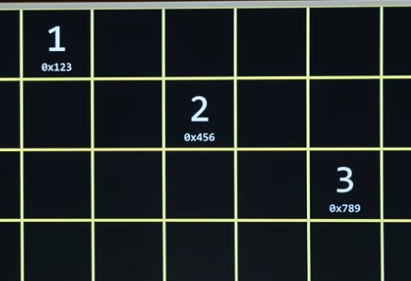
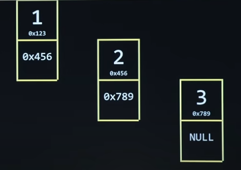
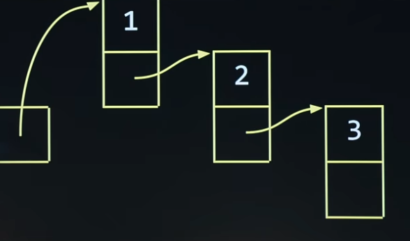
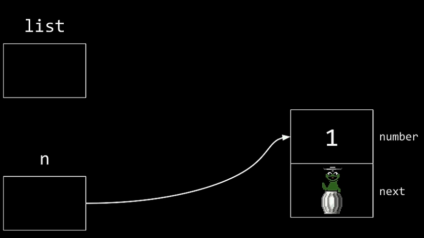

# 포인터 리뷰

- struct
- `.`: struct의 안에 있는 정보에 도달 가능
- `*`: struct 중 어느 struct로 가야할 지 알려주는 역할
- `->`: `.`과 `*` 합침

# Linked List

## 문제 상황

1. Array: 자동으로 연속되게 저장함
   - 이미 크기가 지정된 array에 데이터를 저장하고 싶을 때
     - 추가로 메모리를 확보해야함
2. 어디든 메모리를 저장할 순 있지만, 이것이 연결되어있지 않음
   - 연속되지 않은 메모리에 저장할 때 필요
3. 다음에 어디로 갈 지를 지정하기 위해 포인터 필요


### 예시
-  아무데나 저장
    
    - 이렇게 저장할 경우
    - 다음 데이터를 찾을 때 시간이 많이 듦
- Linked List
    
    - 한 번에 두 개의 노드를 사용하기 때문에 메모리는 더 사용하지만
    - 시간은 줄어드는 방법
    - 저장할 때 다음 데이터의 메모리를 함께 저장하기
    - 마지막 노드에서 저장하는 주소값은 `0x0`(NULL)

    
    - 화살표가 pointer라고 생각하면 됨

> 참고: person이라는 구조체를 저장하는 방법
```c
typedef struct
{
    string name;
    string number;
} person;
```

## 링크드 리스트의 노드 저장법
```c
typedef struct
{
    int number;
    node *next;
} node;
```
- 이렇게 하면 선언되는 노드가 무엇인지 모름 (절차지향)

```c
typedef struct node
{
    int number;
    struct node *next;
} node;
```
- struct 옆에 node를 써줘야 함
- 마지막 줄 node 앞엔 struct 생략 가능



```c
(*n).number = 1;
// 같은 표현, 더 자주 씀
n -> number = 1;
```
- orphan: 링크가 잘못 되어 아무것도 이어지지 않은 노드

### 코드 예시
```c
#include <stdio.h>
#include <stdlib.h>

typedef struct node
{
    int number;
    struct node *next;
} node;

int main(int argc, char *argv[]) {
    node *list = NULL;

    for (int i = 1; i < argc; i++)
    {
        int number = atoi(argv[i]);

        node *n = malloc(sizeof(node)); // 메모리 할당
        if (n == NULL)
        {
            return 1;
        }
        n -> number = number;
        n -> next = list;
        list = n;
    }

    // Print Whole List
    node *ptr = list;
    while (ptr != NULL)
    {
        printf("%i\n", ptr -> number);
        ptr = ptr -> next;
    }
    
    // 3
    // 2
    // 1
}
```

## 시간 복잡도
- Search: `O(N)`
- 앞에서 저장할 때(최선의 경우): `O(1)`
- 뒤에 저장할 때(맨 끝까지 갈 때): `O(N)`
- 저장할 때 비교하면서
    - 정렬된 경우: `O(logN)` (이진탐색 사용)
    - 정렬되지 않은 경우: `O(N)`