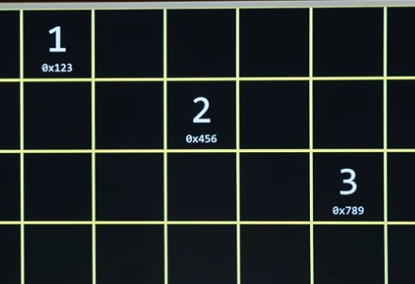

# CS50_[이다혜] Data Structures

작성 일시: 2025년 3월 5일 오후 4:57

# 트리(tree)란?🌲

---

- 트리(Tree)는 계층적인 구조를 표현하는 비선형 자료구조로, 여러 개의 노드(Node)로 구성됨.
- 트리는 한 개의 루트 노드(Root Node)를 가지며, 각 노드는 여러 개의 자식 노드(Child Node)를 가질 수 있지만, 부모 노드(Parent Node)는 하나만 존재함.

---

### **트리의 기본 용어 🌳**

1. **노드(Node)**: 트리를 구성하는 기본 요소로, 값과 다른 노드와의 연결 정보를 가짐
2. **루트 노드(Root Node)**: 트리의 최상위 노드이며, 부모가 없는 유일한 노드
3. **부모 노드(Parent Node)**: 자식 노드를 가지는 노드
4. **자식 노드(Child Node)**: 부모 노드에서 연결된 하위 노드
5. **형제 노드(Sibling Node)**: 같은 부모를 가지는 노드
6. **리프 노드(Leaf Node)**: 자식이 없는 노드로, 트리의 끝에 위치
7. **깊이(Depth)**: 루트에서 특정 노드까지의 거리(레벨)
8. **높이(Height)**: 특정 노드를 루트로 하는 서브트리에서 가장 깊은 리프 노드까지의 거리
9. **서브트리(Subtree)**: 특정 노드를 루트로 하는 작은 트리

---

### **트리의 종류🌳**

1. **이진 트리(Binary Tree)**: 각 노드가 최대 두 개의 자식 노드를 가지는 
2. **완전 이진 트리(Complete Binary Tree)**: 마지막 레벨을 제외하고 모든 레벨이 꽉 차 있으며, 마지막 레벨의 노드는 왼쪽부터 채워져 있는 트리
3. **포화 이진 트리(Full Binary Tree)**: 모든 노드가 0개 또는 2개의 자식 노드를 가지는 트리
4. **균형 이진 트리(Balanced Binary Tree)**: 모든 리프 노드의 깊이가 비슷한 트리
5. **이진 탐색 트리(Binary Search Tree, BST)**: 왼쪽 자식 노드는 부모보다 작은 값, 오른쪽 자식 노드는 부모보다 큰 값을 가지는 트리
6. **AVL 트리, 레드-블랙 트리**: 균형을 유지하는 이진 탐색 트리
7. **힙(Heap)**: 부모 노드가 자식보다 크거나 작은 값을 가지도록 정렬된 트리
8. **트라이(Trie)**: 문자열 검색에 최적화된 트리

---

### **트리의 주요 활용 예시**

- **파일 시스템**: 폴더 구조를 표현하는 데 사용
- **데이터베이스 인덱싱**: B-트리, B+트리 등을 사용하여 빠른 검색을 수행
- **네트워크 라우팅**: 경로 탐색 및 최적화에 활용
- **AI 및 게임 개발**: 의사결정 트리(Decision Tree), 상태 트리(State Tree)로 활용

# **이진 탐색 트리(Binary Search Tree, BST)란?** 🌲

이진 탐색 트리(BST)는 이진 트리(Binary Tree)의 일종으로, 탐색(search), 삽입(insert), 삭제(delete) 연산이 효율적으로 이루어지는 자료구조

---



### **이진 탐색 트리의 특징**

1. **모든 노드는 최대 두 개의 자식 노드를 가진다.**
2. **왼쪽 서브트리(Left Subtree)의 값들은 부모 노드보다 작다.**
3. **오른쪽 서브트리(Right Subtree)의 값들은 부모 노드보다 크다.**
4. **중복된 값을 허용하지 않는다.**

이러한 규칙을 따르면, 트리의 탐색 속도가 **O(log N)** 수준으로 빨라질 수 있음

 (단, 트리가 한쪽으로 치우친 형태가 되면 최악의 경우 **O(N)** 이 될 수도 있음.)

---

### **이진 탐색 트리 예시**

다음과 같은 숫자를 BST에 삽입하면 트리는 아래와 같은 형태가 됨  

삽입할 값: `50, 30, 70, 20, 40, 60, 80`

```

        50
       /  \
      30   70
     /  \  /  \
   20   40 60  80

```

- **50**이 루트(root) 노드.
- 왼쪽 자식 노드들은 부모보다 작은 값을 가지며, 오른쪽 자식 노드들은 부모보다 큰 값을 가짐